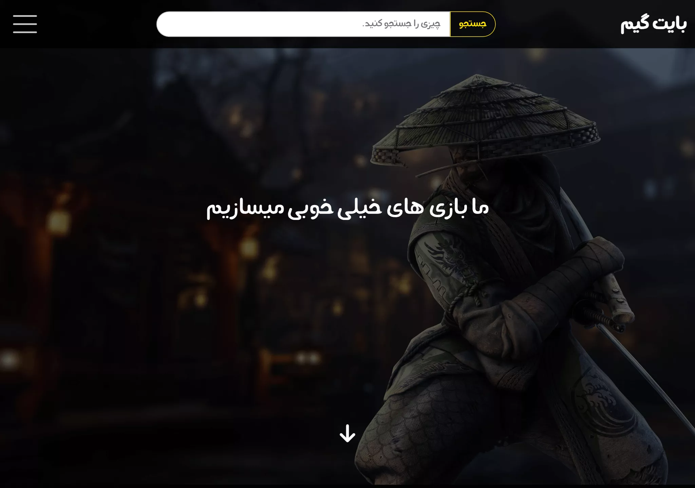
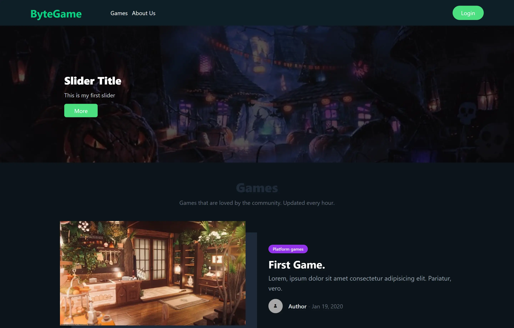
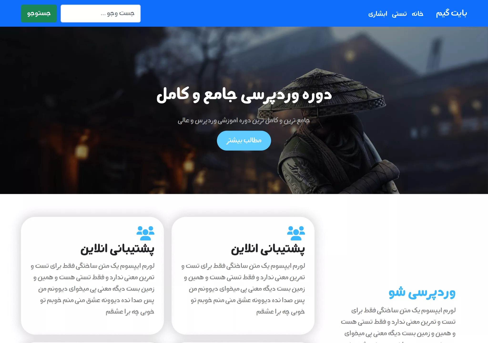
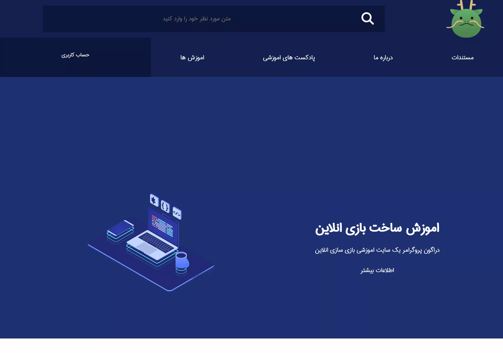

# Description
my first web pages are here.
the main reason I made this public is that i wanted to use github static pages feature.

# توضیحات
اولین وب پیج های خودمو اینجا گذاشتم. فکر نکنم چیز جذابی برای شما داشته باشه. ولی میتونید ببینید که چقدر اولین صفحاتی که ساختم چه افتضاحی بوده. هر چند که الانم تغییری نکردم :)

# Web Pages
- [bytegame first edition](https://github.com/MohammadShool/old-memory-web-pages/tree/main/bytegame-first-edition)
    - [blog detail](https://mohammadshool.github.io/old-memory-web-pages/bytegame-first-edition/blog-detail.html)
    - [blog](https://mohammadshool.github.io/old-memory-web-pages/bytegame-first-edition/blog.html)
    - [game detail](https://mohammadshool.github.io/old-memory-web-pages/bytegame-first-edition/game-detail.html)
    - [games](https://mohammadshool.github.io/old-memory-web-pages/bytegame-first-edition/games.html)
    - [index](https://mohammadshool.github.io/old-memory-web-pages/bytegame-first-edition/index.html)
    - [login](https://mohammadshool.github.io/old-memory-web-pages/bytegame-first-edition/login.html)
    - [register](https://mohammadshool.github.io/old-memory-web-pages/bytegame-first-edition/register.html) 
- [bytegame tailwind version](https://github.com/MohammadShool/old-memory-web-pages/tree/main/bytegame-tailwind-version)
    - [404](https://mohammadshool.github.io/old-memory-web-pages/bytegame-tailwind-version/404.html)
    - [home](https://mohammadshool.github.io/old-memory-web-pages/bytegame-tailwind-version/front-page.html)
    - [posts](https://mohammadshool.github.io/old-memory-web-pages/bytegame-tailwind-version/index.html)
    - [single post](https://mohammadshool.github.io/old-memory-web-pages/bytegame-tailwind-version/single.html)
- [dandedo](https://github.com/MohammadShool/old-memory-web-pages/tree/main/dandedo)
    - [index](https://mohammadshool.github.io/old-memory-web-pages/dandedo/index.html)
- [dragon programmer](https://github.com/MohammadShool/old-memory-web-pages/tree/main/dragon-programmer)
    - [index](https://mohammadshool.github.io/old-memory-web-pages/dragon-programmer/index.html)
    - [login](https://mohammadshool.github.io/old-memory-web-pages/dragon-programmer/login.html)
    - [register](https://mohammadshool.github.io/old-memory-web-pages/dragon-programmer/register.html)
- [hotel and airbus](https://github.com/MohammadShool/old-memory-web-pages/tree/main/hotel-and-airbus)
    - [index](https://mohammadshool.github.io/old-memory-web-pages/hotel-and-airbus/index.html)
- [mihanwp](https://github.com/MohammadShool/old-memory-web-pages/tree/main/mihanwp)
    - [index](https://mohammadshool.github.io/old-memory-web-pages/mihanwp/index.html)
- [the best blog](https://github.com/MohammadShool/old-memory-web-pages/tree/main/the-best-blog)
    - [404](https://mohammadshool.github.io/old-memory-web-pages/the-best-blog/404.html)
    - [index](https://mohammadshool.github.io/old-memory-web-pages/the-best-blog/index.html)
    - [blog](https://mohammadshool.github.io/old-memory-web-pages/the-best-blog/blog.html)
    - [single post](https://mohammadshool.github.io/old-memory-web-pages/the-best-blog/single.html)

## screenshots

    
    
    

    
    
    

    

