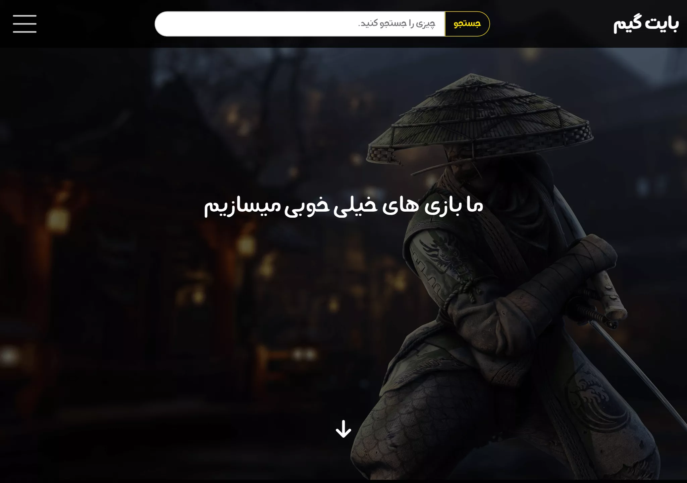
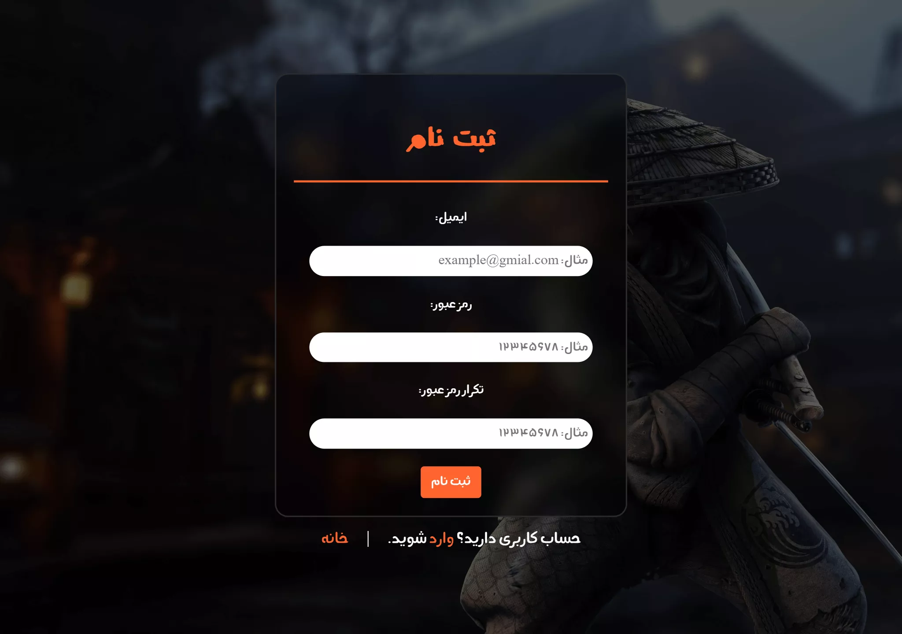

# about this repository

this code is very old and i just keep it as memory

To remember where my exploration of computers began.

> this is just a html & css template

## Pages

- [Blog Detail Page](#blog-detail)
- [Blog Page](#blog)
- [Game Detail Page](#game-detail)
- [Games Page](#games)
- [Index Page](#index)
- [Login Page](#login)
- [Register Page](#register)

## blog detail

    
    

> [live preview](https://mohammadshool.github.io/old-memory-web-pages/bytegame-first-edition/blog-detail.html)

## blog

    
    

> [live preview](https://mohammadshool.github.io/old-memory-web-pages/bytegame-first-edition/blog.html)

## game detail

    
    

> [live preview](https://mohammadshool.github.io/old-memory-web-pages/bytegame-first-edition/game-detail.html)

## games

    
    

> [live preview](https://mohammadshool.github.io/old-memory-web-pages/bytegame-first-edition/games.html)

## index

    
    

> [live preview](https://mohammadshool.github.io/old-memory-web-pages/bytegame-first-edition/index.html)

## login

    
    

> [live preview](https://mohammadshool.github.io/old-memory-web-pages/bytegame-first-edition/login.html)

## register

    
    

> [live preview](https://mohammadshool.github.io/old-memory-web-pages/bytegame-first-edition/register.html)