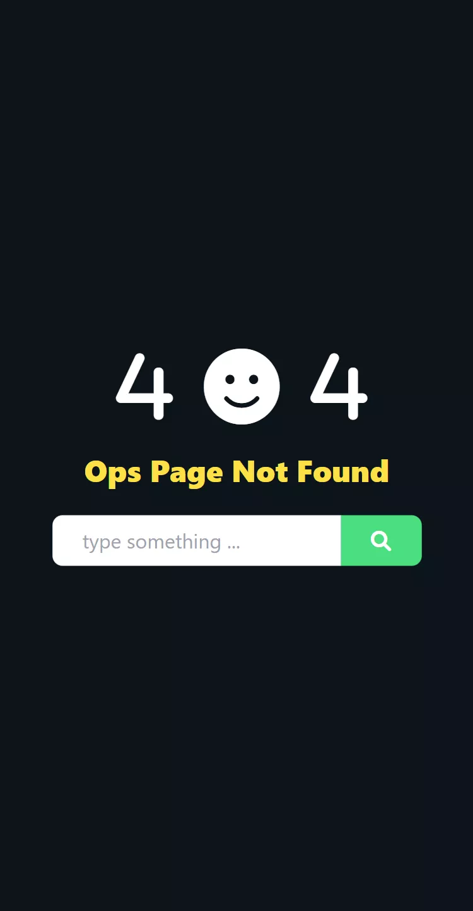
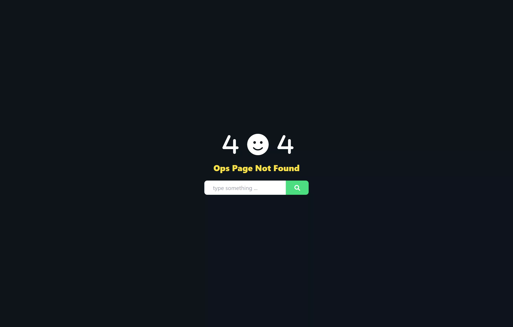
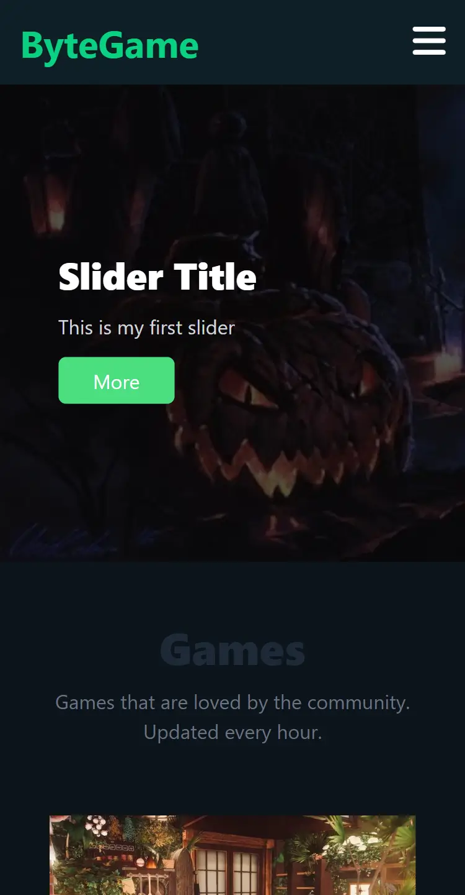
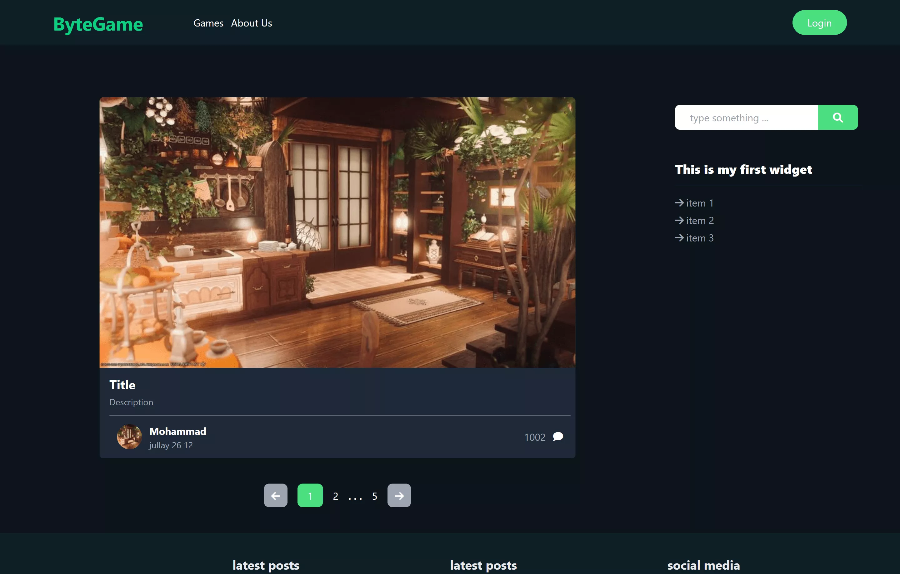
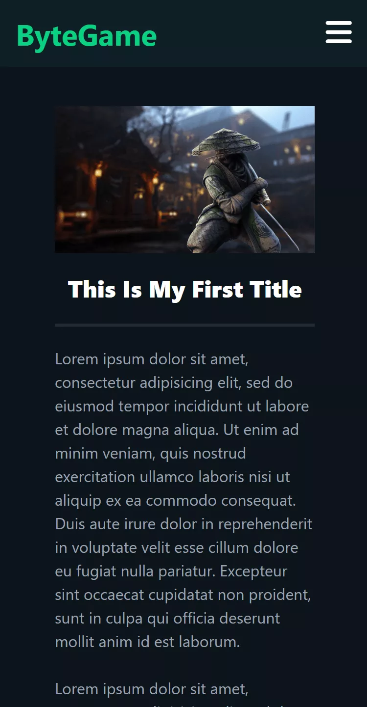
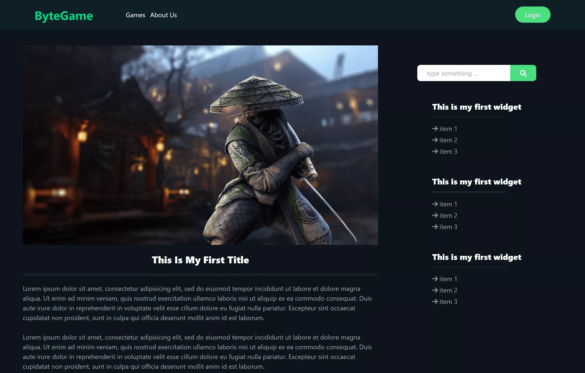

# about this repository

this code is very old and i just keep it as memory

To remember where my exploration of computers began.

> this is just a html template with tailwind css styling

## Pages

- [Not Found Page](#404)
- [Home Page](#home)
- [Posts Page](#posts)
- [Single Page](#single-post)

## 404

    
    

> [live preview](https://mohammadshool.github.io/old-memory-web-pages/bytegame-tailwind-version/404.html)

## home

    
    

> [live preview](https://mohammadshool.github.io/old-memory-web-pages/bytegame-tailwind-version/front-page.html)

## posts

    

> [live preview](https://mohammadshool.github.io/old-memory-web-pages/bytegame-tailwind-version/index.html)

## single post

    
    

> [live preview](https://mohammadshool.github.io/old-memory-web-pages/bytegame-tailwind-version/single.html)