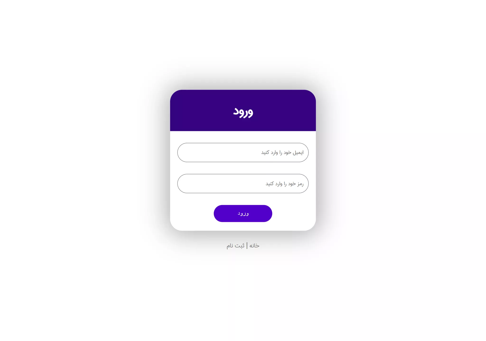
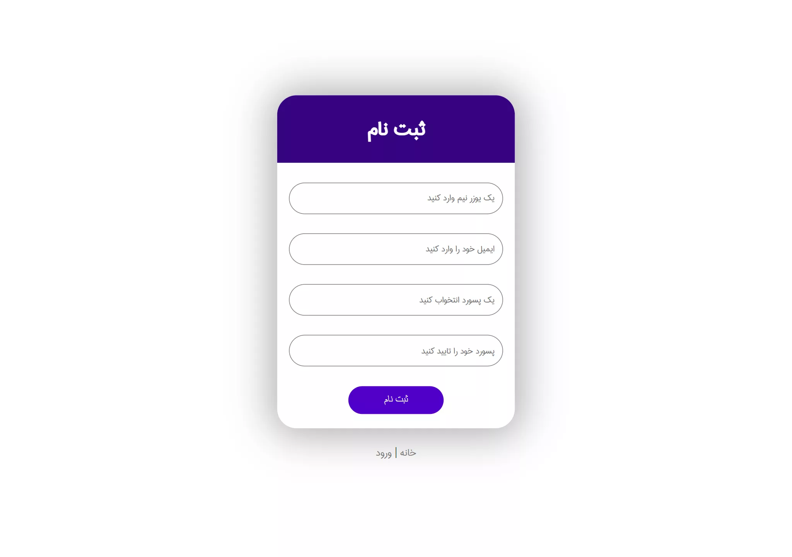

# about this repository

this code is very old and i just keep it as memory

To remember where my exploration of computers began.

> this is just a html template with html and css

## Pages

- [Index Page](#index)
- [Login Page](#login)
- [Register Page](#register)

## index

    
    

> [live preview](https://mohammadshool.github.io/old-memory-web-pages/dragon-programmer/index.html)

## login

    
    

> [live preview](https://mohammadshool.github.io/old-memory-web-pages/dragon-programmer/login.html)

## register

    
    

> [live preview](https://mohammadshool.github.io/old-memory-web-pages/dragon-programmer/register.html)