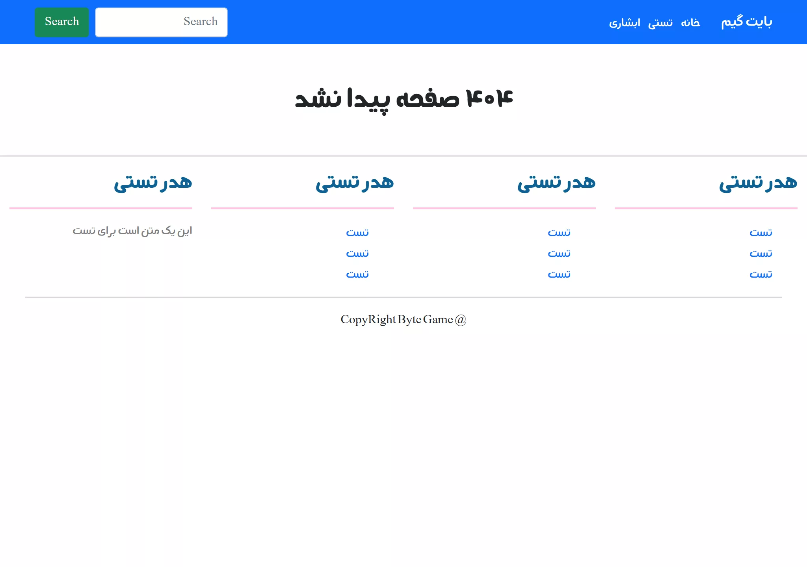
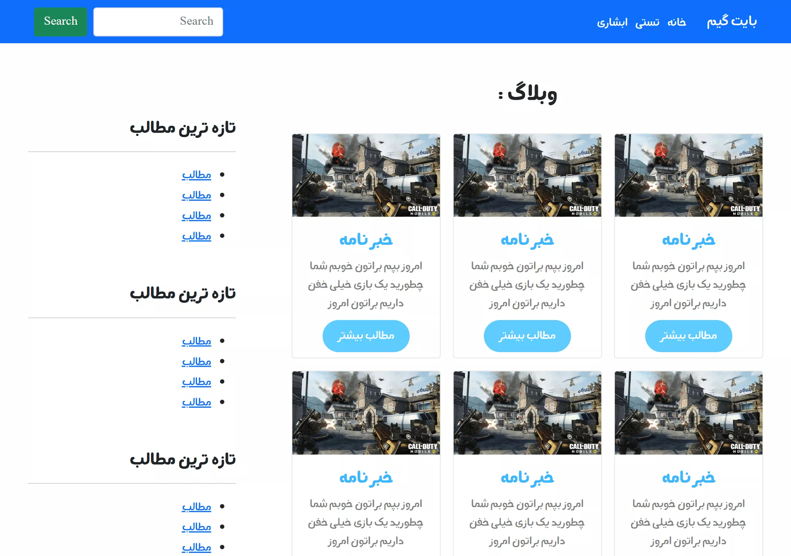
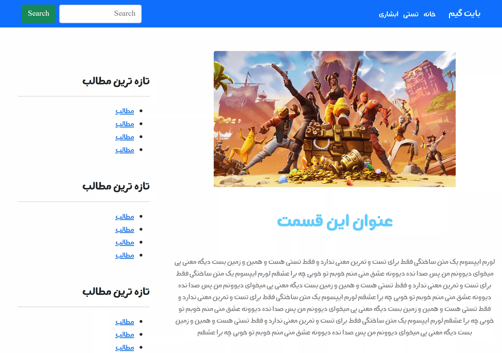

# about this repository

this code is very old and i just keep it as memory

To remember where my exploration of computers began.

> this is just a html & css template

## Pages

- [Not Found Page](#404)
- [Index Page](#Index)
- [Blog Page](#Blog)
- [Single Page](#single-post)

## 404

    
    

> [live preview](https://mohammadshool.github.io/old-memory-web-pages/the-best-blog/404.html)

## Index

    
    

> [live preview](https://mohammadshool.github.io/old-memory-web-pages/the-best-blog/index.html)

## Blog

    
    

> [live preview](https://mohammadshool.github.io/old-memory-web-pages/the-best-blog/blog.html)

## Single Post

    
    

> [live preview](https://mohammadshool.github.io/old-memory-web-pages/the-best-blog/single.html)